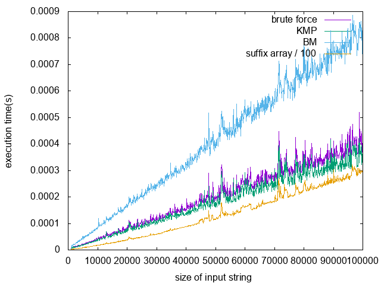
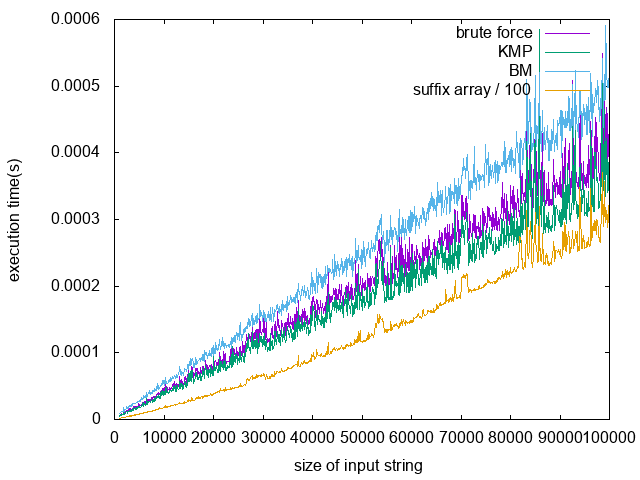
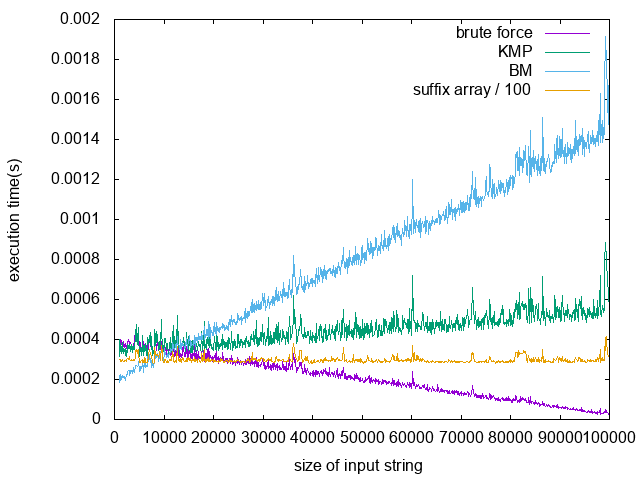

# benchmark
## text_search
  - brute force
  - KMP
  - BM
  - suffix array

    - execution time for pattern length 5
  
    - execution time for pattern length 10
  
    - execution time for input length 100000
  

### note
  - all calculation are taken 10 times
  - order of calculation:
    - brute force: O(n^2)
    - KMP: O(n)
    - BM: O(n/m)
    - suffix array: O(nlg^2 + lgn + m)
  - execution time for suffix array include construction time of suffix array (O(nlg^2n))
  - my implementation of BM algorithm has back step to avoid infinite loop
